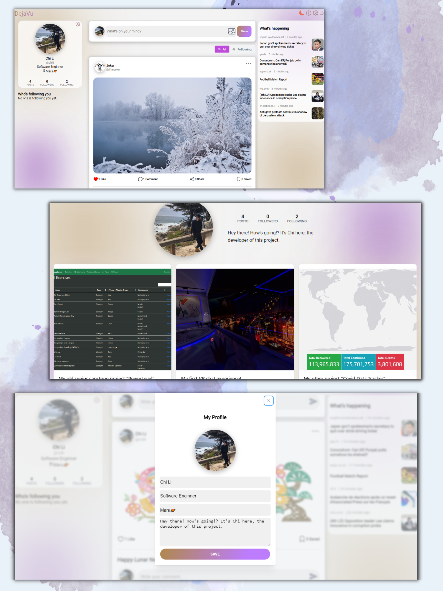

<div id="top"></div>

<!-- PROJECT LOGO -->
<br />
<div>
<h1 align="center">DejaVu</h1>
  <p align="center">
    An fullstack social network web application, developed using MERN stack.
    <br />
    <a href="https://dejavudemo.netlify.app/"><strong>View Demo »</strong></a>
    <br />
    <br />
    <a href="https://github.com/ChiShingLi/DejaVu/tree/master/client">Frontend client Source Code</a>
    ·
    <a href="https://github.com/ChiShingLi/DejaVu/tree/master/server">Backend server Source Code</a>
  </p>
</div>


<!-- TABLE OF CONTENTS -->
<details>
  <summary>Table of Contents</summary>
  <ol>
    <li>
      <a href="#about-the-project">About The Project</a>
      <ul>
        <li><a href="#built-with">Built With</a></li>
      </ul>
    </li>
    <li>
      <a href="#getting-started">Getting Started</a>
      <ul>
        <li><a href="#installation">Installation</a></li>
      </ul>
    </li>
    <li><a href="#roadmap">Roadmap</a></li>
  </ol>
</details>


<!-- ABOUT THE PROJECT -->
## About The Project
**DeJaVu** is a full-stack social networking web application, built using the MERN stack. It allows users to communicate and interact with other users by sharing their thoughts, ideas and opinions in the form of photo and text feed. 




<p align="right">(<a href="#top">back to top</a>)</p>


### Built With
* ![React.js]
* ![Node.js]
* ![CSS]
* ![MongoDB]
* ![Express]
* ![Netlify]

<p align="right">(<a href="#top">back to top</a>)</p>

<!-- ROADMAP -->
## Frontend Client Roadmap

- [x] User profile card
- [x] Follower Card
- [x] Main section user feeds card
- [x] Trending news card
    - [x] news data fetch from public API
- [x] Light/dark theme with transition
- [x] Spinner Loader and notification feature 
- [x] User Profile details Page
  - [x] Personal Feeds
- [x] Project "About" page
- [x] Project "Settings" page
- [x] Protected routes 


## Backend Server Roadmap
- [x] User login
- [x] User signup
- [x] Post Feeds Logics:
  - [x] Fetch Feed
  - [x] Create Feed
  - [x] Delete Feed
  - [x] Update Feed
- [x] Feeds Logic:
  - [x] Display all user Feed
  - [x] Display only self and Following user Feeds
  - [x] Display Feed by timestamp
- [x] Follower logics:
  - [x] Follow a user
  - [x] Unfollow a user

<p align="right">(<a href="#top">back to top</a>)</p>

## Installation

1. To setup news widget's API: [https://thenewsapi.com](https://thenewsapi.com)
2. Sign up for a [MongoDB Atlas database API key](https://www.mongodb.com/atlas/database)
3. Clone the repo
   ```sh
   git clone https://github.com/ChiShingLi/DejaVu.git
   ```
4. Install NPM packages
   ```sh
   npm install
   ```
5. Enter your API secrets in the `.env` file
   - **FrontEnd Client:**
   ```js
   REACT_APP_NEWS_API_KEY = "ENTER YOUR NEWS ACCOUNT API";
  
   REACT_APP_DATABASE_URL = "ENTER YOUR MONGODB DATABASE URL";
   ```

   - **Backend Client:**
   ```js
   PORT = "ENTER YOUR MONGODB DATABASE PORT NUMBER";

   DB_PATH = "ENTER YOUR MONGODB DATABASE CONNECTION STRING";

   JWT_SECRET = "ENTER YOUR JSON WEB TOKEN SECRET KEY";
   ```
<p align="right">(<a href="#top">back to top</a>)</p>

<!-- MARKDOWN LINKS & IMAGES -->
[React.js]: https://img.shields.io/badge/React-20232A?style=for-the-badge&logo=react&logoColor=61DAFB
[JQuery.com]: https://img.shields.io/badge/jQuery-0769AD?style=for-the-badge&logo=jquery&logoColor=white
[Node.js]: https://img.shields.io/badge/Node.js-43853D?style=for-the-badge&logo=node.js&logoColor=white
[CSS]:https://img.shields.io/badge/CSS3-1572B6?style=for-the-badge&logo=css3&logoColor=white
[MongoDB]:https://img.shields.io/badge/MongoDB-4EA94B?style=for-the-badge&logo=mongodb&logoColor=white
[Express]:https://img.shields.io/badge/Express.js-404D59?style=for-the-badge
[Netlify]:https://img.shields.io/badge/Netlify-00C7B7?style=for-the-badge&logo=netlify&logoColor=white
[Heroku]:https://img.shields.io/badge/Heroku-430098?style=for-the-badge&logo=heroku&logoColor=white
[JWT]:https://img.shields.io/badge/json%20web%20tokens-323330?style=for-the-badge&logo=json-web-tokens&logoColor=pink
